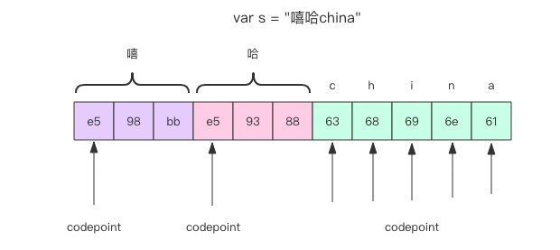

### string
- 不定长字节串表示

- item by byte
```go
for i := 0; i<len(str); i++
```
- item by utf8
```go
for codepoint, runeValue := range str
```
- 字符串赋值是浅拷贝,底层字节数组是共享的
- 字符串是只读的, 无法根据下标做修改
- 子串和母串共享底层字节数组
- 字符串和切片的切换
```go
slice = []byte(str)
str = string(slice)
```

